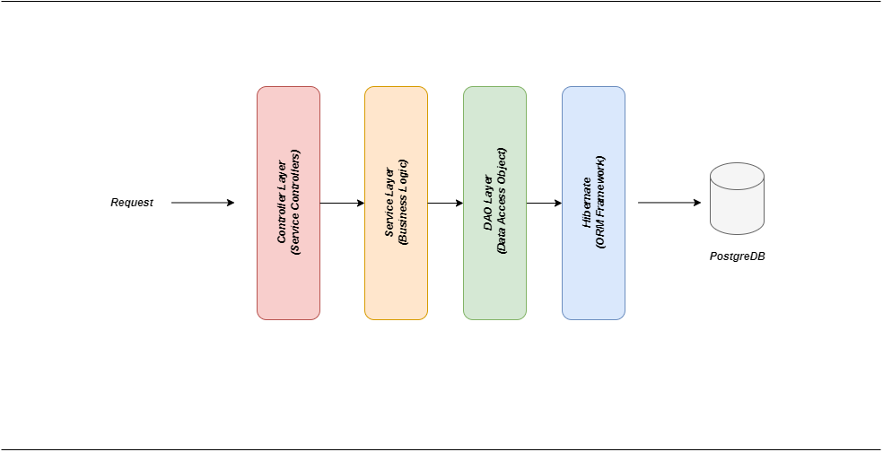

# Planification-des-examens-avec-Spring-Boot-Framework
Conception et Developpement d'un application des gestion des examens avec Spring boot Framework

## Introduction
Cette application permet de planifier et gérer les examens en utilisant le framework Spring Boot. Elle offre des fonctionnalités pour ajouter, modifier, supprimer et afficher les examens, ainsi que pour gérer les salles et les surveillants.

## Prérequis
Avant de commencer, assurez-vous d'avoir installé les éléments suivants :

- Java JDK 11 ou supérieur
- Maven
- IDE (IntelliJ IDEA, Eclipse, etc.)
- PostgreSQL (ou tout autre SGBD supporté par Spring Data JPA, A condition de changer les propretes de chaque SGBD dans le fichier application.properties)

## Architecture

## Installation

### 1. Cloner le dépôt :
git clone https://github.com/Ghost1762/Planification-des-examens-avec-Spring-Boot-Framework.git

### 2. Configurer la base de données :
spring.datasource.url=jdbc:votreSGBD://host:port/NomDB
spring.datasource.username=yourUsername
spring.datasource.password=yourPassword
spring.jpa.hibernate.ddl-auto=update

### 3. Construire l'application :
mvn clean install

### 4. Lancer l'application :
mvn spring-boot:run

### 5. Les fonctionnalités :
- L'ajout d'un examen.

- La suppression d'un examen.

- La modification.

- L'affectation des salles.
- L'affectation des surveillants et des controlleurs d'absence.

- L'inclusion le procès-verbal, le rapport et le relevé d'examen.

### 6. Contribuer :
Les contributions sont les bienvenues !

### 7. Auteurs :
EL BOUMASHOULI Naouar - Pour n'importe quelle question ou remarque, veuillez me contacter sur https://www.linkedin.com/in/n-boumashouli/
